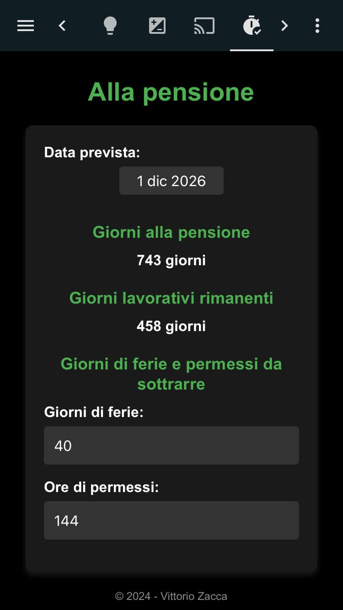
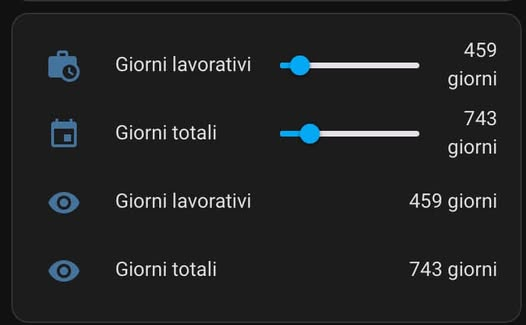

**Descrizione Generica della Pagina Web**

Questa pagina web, di cui vedete uno screenshot è intitolata “HAP”. 

L'ho progettata per calcolare:

1. Giorni rimanenti alla pensione:
Determinati dalla data di pensionamento inserita dall'utente.
Mostrati dinamicamente nella sezione "Giorni alla pensione".
1. Giorni lavorativi rimanenti:
Calcolati escludendo sabati, domeniche e festività italiane, in base alla data di pensionamento e a eventuali ferie e permessi specificati dall'utente.
Visualizzati nella sezione "Giorni lavorativi rimanenti".
1. Interazione dinamica:
Permette all'utente di salvare la data di pensionamento, i giorni di ferie e le ore di permesso utilizzando i cookie.
I calcoli vengono aggiornati automaticamente in base ai dati immessi dall'utente.
1. Integrazione con Home Assistant:
I valori di "Giorni alla pensione" e "Giorni lavorativi rimanenti" vengono inviati automaticamente a Home Assistant tramite WebSocket, aggiornando le entità input_number.days e input_number.workday_count.

Ad esempio, nell'immagine qui sotto potete vedere le entità input_number.days e input_number.workday_count che poi ho trasformato in sensori per utilizzi futuri.

**Istruzioni per Farla Interagire con Home Assistant**

Una configurazione attiva di Home Assistant.
La chiave di autorizzazione (access token) valida per l'accesso ai WebSocket API di Home Assistant.
Due entità di tipo input_number configurate in Home Assistant

        input_number:
        workday_count:
          name: Giorni lavorativi
          initial: 0
          min: 0
          max: 3650
          step: 1
          unit_of_measurement: "giorni"
          icon: mdi:briefcase-clock
      
        days:
          name: Giorni totali
          initial: 0
          min: 0
          max: 3650
          step: 1
          unit_of_measurement: "giorni"
          icon: mdi:calendar
    
Sezione di codice della pagina html da personalizzare:

        const url = "ws://indirizzo_HA:8123/api/websocket";
        const authToken = "codice autorizzazine";    

Ricordo che la pagina va caricata nella cartella locale di Home Assistant (www) e per la Dashboards il riferimento sarà quindi /local/hap.html.     

Riavvia Home Assistant dopo aver aggiunto queste entità e personalizzato il codice html.

